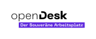

# Element Web Modules

A collection of modules for [Element](https://github.com/vector-im/element-web/) using the [Module API](https://www.npmjs.com/package/@matrix-org/react-sdk-module-api).

## Included Modules

### Element Web Guest Module

A module to login as a guest.
This module also requires the installation of a Synapse module:

- See the [Readme of the `element-web-guest-module`](./packages/element-web-guest-module/README.md) for instructions on how to install it in Element.
- See the [Readme of the `synapse-guest-module`](./packages/synapse-guest-module/README.md) for instructions on how to install it in your Synapse homeserver.

### Element Web openDesk Module

A module to provide openDesk specific functionality.

- See the [Readme of the `element-web-opendesk-module`](./packages/element-web-opendesk-module/README.md) for instructions on how to install it in Element.

### Element Web Widget Lifecycle Module

A module to approve widget capabilities so the user is asked:

- See the [Readme of the `element-web-widget-lifecycle-module`](./packages/element-web-widget-lifecycle-module/README.md) for instructions on how to install it in Element.

### Element Web Widget Toggles Module

A module to provide widget toggles.

- See the [Readme of the `element-web-widget-toggles-module`](./packages/element-web-widget-toggles-module/README.md) for instructions on how to install it in Element.

## Getting Started

Development on the module happens at [GitHub](https://github.com/nordeck/element-web-modules).

### How to Contribute

Please take a look at our [Contribution Guidelines](https://github.com/nordeck/.github/blob/main/docs/CONTRIBUTING.md).

### Requirements

You need to install Node.js (`>= 20.0.0`, prefer using an LTS version) and run
`yarn` to work on this package.

### Installation

After checkout, run `yarn install` to download the required dependencies

> [!WARNING]
> Do not use `npm install` when working with this package.

### Available Scripts

In the project root directory, you can run:

- `yarn build`: Build the production version of the modules.
- `yarn test`: Watch all files for changes and run tests.
- `yarn tsc`: Check TypeScript types for errors in the modules.
- `yarn lint`: Run eslint on the module.
- `yarn prettier:write`: Run prettier on all files to format them.
- `yarn depcheck`: Check for missing or unused dependencies.
- `yarn deduplicate`: Deduplicate dependencies in the `yarn.lock` file.
- `yarn changeset`: Generate a changeset that provides a description of a
  change.
- `yarn docker:build`: Builds a container from the output of `yarn build`.

### Versioning

This package uses automated versioning.
Each change should be accompanied with a specification of the impact (`patch`, `minor`, or `major`) and a description of the change.
Use `yarn changeset` to generate a new changeset for a pull request.
Learn more in the [`.changeset` folder](./.changeset).

Once the change is merged to `main`, a “Version Packages” pull request will be created.
As soon as the project maintainers merged it, the package will be released and the container is published.

## License

This project is licensed under [APACHE 2.0](./LICENSE).

## Sponsors

   
   &nbsp;&nbsp;&nbsp;&nbsp;
   

This project is part of [openDesk](https://www.cio.bund.de/Webs/CIO/DE/digitale-loesungen/digitale-souveraenitaet/souveraener-arbeitsplatz/souverarner-arbeitsplatz-node.html).
