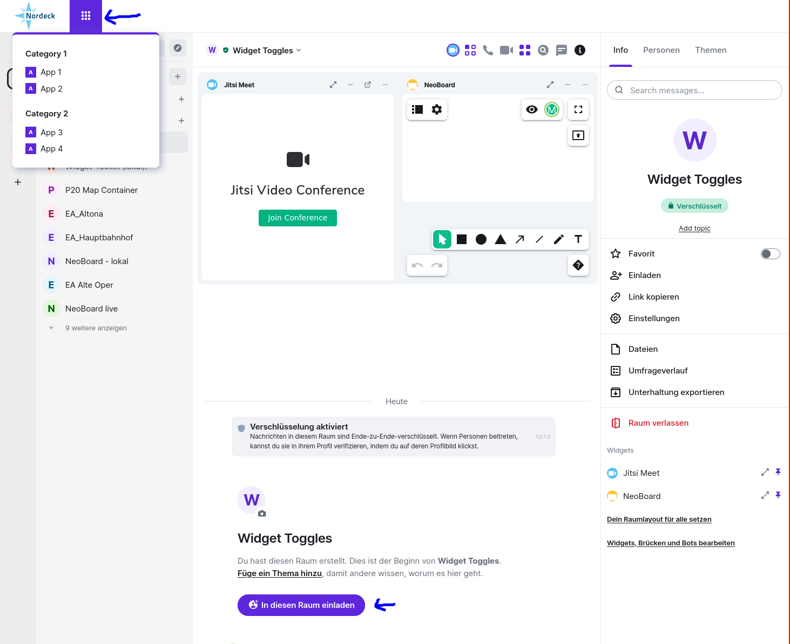

# Element Web openDesk Module

A module for Element to provide openDesk specific functionality.

It uses the [Module API](https://www.npmjs.com/package/@matrix-org/react-sdk-module-api) to add the openDesk navbar.


Features:

- Add a navigation bar to Element.
- Customize the theme colors of Element.

## Requirements

The minimal Element version to use this module is `1.11.50`.

## Install the Element Module

Checkout Element and setup the development environment according to [their documentation](https://github.com/vector-im/element-web/#building-from-source).
Go into the `element-web` folder and create a `build_config.yaml` file with the following content:

```yaml
modules:
  - '@nordeck/element-web-opendesk-module@^0.0.1'
```

Build Element and deploy your custom version as described by the original documentation.
In case you want to create a docker-based build process, you might find inspiration in the setup [we use for our e2e tests](../../e2e/src/deploy/elementWeb/Dockerfile).

## Configure the Element Module

The module provides the following optional configuration options:

- `banner` - Enable the banner component.
  - `ics_navigation_json_url` - The URL of the `navigation.json` file that contains the navigation structure for the user.
  - `ics_silent_url` - The URL of the silent endpoint that is used via inline frame to log in the user.
  - `portal_logo_svg_url` - The URL of the portal `logo.svg` file.
  - `portal_url` - The URL of the portal.
- `custom_css_variables` - a configuration of `--cpd-color-*` css variables to override selected colors in the Element theme. The [Element Compound](https://compound.element.io/?path=/docs/tokens-semantic-colors--docs) documentation has a list of all available options.

For the navigation bar and launcher, the following variables are relevant:

- `--cpd-color-text-action-accent` sets the background of the launcher icon when expanded and the top border of the menu
- `--cpd-color-icon-on-solid-primary` sets the color of the launcher icon when expanded

To have the primary button background color consistent with your menu color, use the following variable:

- `--cpd-color-bg-action-primary-rest`

Example configuration:

```jsonc
{
  "net.nordeck.element_web.module.opendesk": {
    "config": {
      "banner": {
        "ics_navigation_json_url": "https://example.com/navigation.json",
        "ics_silent_url": "https://example.com/silent",
        "portal_logo_svg_url": "https://example.com/logo.svg",
        "portal_url": "https://example.com",
      },

      // ... add more optional configurations
      "custom_css_variables": {
        "--cpd-color-bg-action-primary-rest": "#5e27dd",
        "--cpd-color-text-action-accent": "#5e27dd",
        "--cpd-color-icon-on-solid-primary": "#000000",
      },
    },
  },
}
```

## Running the Element Web module locally

1. Run `yarn build` in this repository.

2. Checkout Element and setup the development environment according to [their documentation](https://github.com/vector-im/element-web/#building-from-source).

3. (In the `element-web` folder) Create a `build_config.yaml` with the following content:

   ```yaml
   # Directory structure:
   # <your projects folder>/
   # ├─ element-web/
   # │  ├─ ...
   # │  ├─ build_config.yaml
   # │  ├─ package.json
   # ├─ matrix-react-sdk/
   # │  ├─ ...
   # ├─ matrix-js-sdk/
   # │  ├─ ...
   # ├─ element-web-modules/
   # │  ├─ packages
   # │  │  ├─ element-web-opendesk-module
   # │  │  │  ├─ build/
   # │  │  │  │  ├─ ...
   # │  │  │  ├─ package.json
   # │  │  │  ├─ ...
   # │  ├─ package.json

   modules:
     - 'file:../element-web-modules/packages/element-web-opendesk-module'
   ```

4. Add the following example configuration to the Element Web `config.json`

```json
  "net.nordeck.element_web.module.opendesk": {
      "config": {
          "banner": {
              "ics_navigation_json_url": "http://localhost:8080/open-desk/navigation.json",
              "ics_silent_url": "http://localhost:8080/open-desk/silent-login.html",
              "portal_logo_svg_url": "http://localhost:8080/open-desk/Nordeck-Logo_RGB.svg",
              "portal_url": "https://example.com/portal"
          },
          "custom_css_variables": {
              "--cpd-color-bg-action-primary-rest": "#5e27dd",
              "--cpd-color-text-action-accent": "#5e27dd"
          }
      }
  }

```

5. (In the `element-web` folder) Link the open desk module example files

```
ln -s ../element-web-modules/packages/element-web-opendesk-module/example webapp/open-desk
```

6. (In the `element-web` folder) Run `yarn start` and access it at `http://localhost:8080`

7. There should now be purple buttons and a header with the Nordeck logo plus some example application links



> **Important**: You must run `yarn build` in this repo and restart Element after each change in the module.
