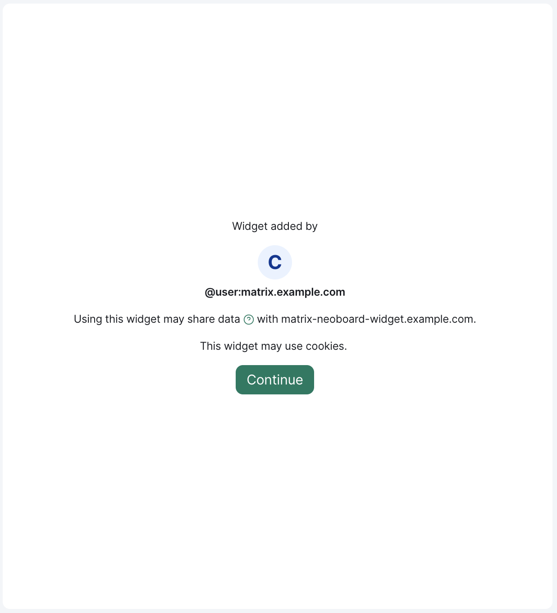
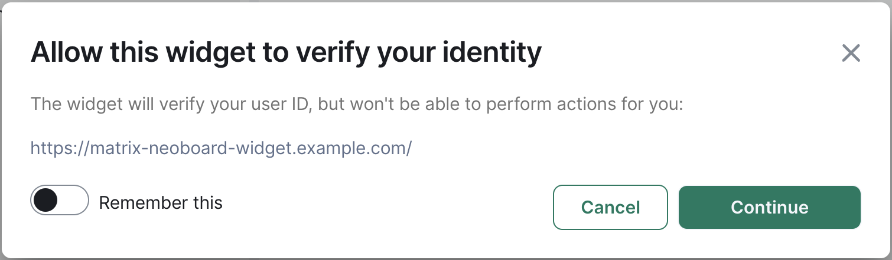
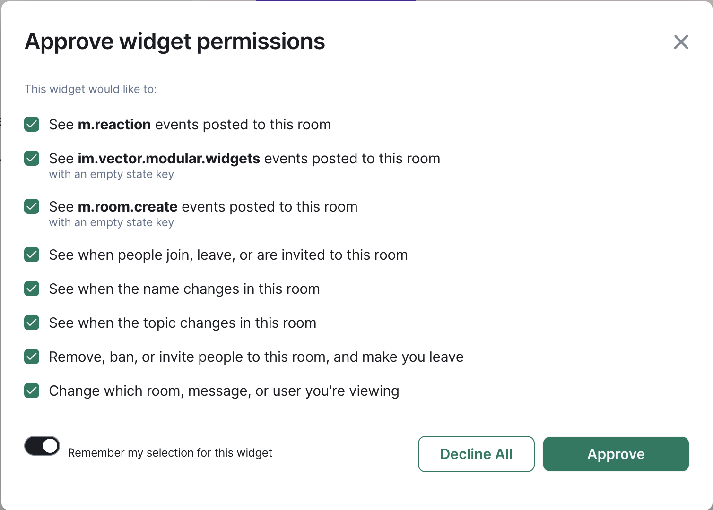

# Element Web Widget Lifecycle Module

A module for Element to automatically accept capabilities for selected widgets.

There are certain security features for widgets that should secure the user.
These include:

<table>
  <tr>
    <th>Preload</th>
    <th>Identity</th>
    <th>Capabilities</th>
  </tr>
  </tr>
    <td>
      
    </td>
    <td>
      
    </td>
    <td>
      
    </td>
  </tr>
</table>

But these security features can lower the usability especially in more integrated environments.
This module was initially created to pre-approve capabilities and permission requests from the widgets if they were added by [NeoDateFix](https://github.com/nordeck/matrix-meetings) so the users are not always asked for permission in every meeting room.
It allows you to selectively skip the permission dialogs for widgets that you trust, while they still appear for widgets that were added by third parties.

> [!WARNING]
> We recommend to only approve widgets that you deployed yourselves. These features should protect your users and you should only disable them for widgets that you trust!

## Requirements

The minimal Element version to use this module is `1.11.40`.

## Install the Element Module

Checkout Element and setup the development environment according to [their documentation](https://github.com/vector-im/element-web/#building-from-source).
Go into the `element-web` folder and create a `build_config.yaml` file with the following content:

```yaml
modules:
  - '@nordeck/element-web-widget-lifecycle-module@^1.0.0'
```

Build Element and deploy your custom version as described by the original documentation.
In case you want to create a docker-based build process, you might find inspiration in the setup [we use for our e2e tests](../../e2e/src/deploy/elementWeb/Dockerfile).

## Configure the Element Module

The module is configured at `net.nordeck.element_web.module.widget_lifecycle` -> `widget_permissions` of the Element configuration.
`widget_permissions` is an object with the Widget URL as key and the configuration for the widget as value.

Each widget configuration can use the following options:

- `preload_approved` - if true, the preload dialog is not displayed for this widget.
- `identity_approved` - if true, requests for the OpenID token are automatically accepted.
- `capabilities_approved` - a list of capabilities that should be approved for this widget.

Example configuration:

```json
{
  "net.nordeck.element_web.module.widget_lifecycle": {
    "widget_permissions": {
      "https://widget.example.com/": {
        "preload_approved": true,
        "identity_approved": true,
        "capabilities_approved": [
          "org.matrix.msc2931.navigate",
          "org.matrix.msc2762.receive.state_event:m.room.power_levels"
        ]
      }
    }
  }
}
```

The widget url and the capabilities can use an `*` at the end to match multiple widgets or capabilities.
This can be handy if widgets have multiple routes or if capabilities contain the variable information such as the user-id as a state key.
We recommend to make the configuration as restricted as possible.

Example configuration with wildcards:

```json
{
  "net.nordeck.element_web.module.widget_lifecycle": {
    "widget_permissions": {
      "https://widget.example.com/*": {
        "preload_approved": true,
        "identity_approved": true,
        "capabilities_approved": [
          "org.matrix.msc2931.navigate",
          "org.matrix.msc2762.receive.state_event:m.room.power_levels",
          "org.matrix.msc2762.send.state_event:net.custom_event#*"
        ]
      }
    }
  }
}
```

> Multiple matching rules are merged field-based, while the most specific match wins in case of conflicts.
> The `capabilities_approved` is not merged but overridden by the most specific match.

## Running the Element Module Locally

1. Run `yarn build` in this repository.

2. Checkout Element and setup the development environment according to [their documentation](https://github.com/vector-im/element-web/#building-from-source).

3. (In the `element-web` folder) Create a `build_config.yaml` with the following content:

   ```yaml
   # Directory structure:
   # <your projects folder>/
   # ├─ element-web/
   # │  ├─ ...
   # │  ├─ build_config.yaml
   # │  ├─ customisations.json
   # │  ├─ package.json
   # ├─ matrix-react-sdk/
   # │  ├─ ...
   # ├─ matrix-js-sdk/
   # │  ├─ ...
   # ├─ element-web-modules/
   # │  ├─ packages
   # │  │  ├─ element-web-widget-lifecycle-module
   # │  │  │  ├─ build/
   # │  │  │  │  ├─ ...
   # │  │  │  ├─ package.json
   # │  │  │  ├─ ...
   # │  ├─ package.json

   modules:
     - 'file:../element-web-modules/packages/element-web-widget-lifecycle-module'
   ```

4. (In the `element-web` folder) Run `yarn start` and access it at `http://localhost:8080`

> **Important**: You must run `yarn build` in this repo and restart Element after each change in the module.
