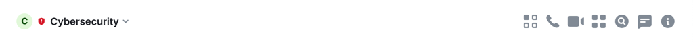

# Element Web Widget Toggles Module

A module for Element to provide widget toggles.

It uses the [Module API](https://www.npmjs.com/package/@matrix-org/react-sdk-module-api) to add widget toggles.



Features:

- Add widget toggles to the room header of Element.

## Requirements

The minimal Element version to use this module is `1.11.58`.

## Install the Element Module

Checkout Element and set up the development environment according to [their documentation](https://github.com/vector-im/element-web/#building-from-source).
Go into the `element-web` folder and create a `build_config.yaml` file with the following content:

```yaml
modules:
  - '@nordeck/element-web-widget-toggles-module@^0.1.0'
```

Build Element and deploy your custom version as described by the original documentation.
In case you want to create a docker-based build process, you might find inspiration in the setup [we use for our e2e tests](../../e2e/src/deploy/elementWeb/Dockerfile).

## Configure the Element Module

The module provides the following optional configuration options:

- `types` - The types of the widgets that should have a toggle.

Example configuration:

```json
{
  "net.nordeck.element_web.module.widget_toggles": {
    "config": {
      "types": ["com.example.*"]
    }
  }
}
```

## Running the Element Module Locally

1. Run `yarn build` in this repository.

2. Checkout Element and set up the development environment according to [their documentation](https://github.com/vector-im/element-web/#building-from-source).

3. (In the `element-web` folder) Create a `build_config.yaml` with the following content:

   ```yaml
   # Directory structure:
   # <your projects folder>/
   # ├─ element-web/
   # │  ├─ ...
   # │  ├─ build_config.yaml
   # │  ├─ package.json
   # ├─ matrix-react-sdk/
   # │  ├─ ...
   # ├─ matrix-js-sdk/
   # │  ├─ ...
   # ├─ element-web-modules/
   # │  ├─ packages
   # │  │  ├─ element-web-widget-toggles-module
   # │  │  │  ├─ build/
   # │  │  │  │  ├─ ...
   # │  │  │  ├─ package.json
   # │  │  │  ├─ ...
   # │  ├─ package.json

   modules:
     - 'file:../element-web-modules/packages/element-web-widget-toggles-module'
   ```

4. (In the `element-web` folder) Run `yarn start` and access it at `http://localhost:8080`

> **Important**: You must run `yarn build` in this repo and restart Element after each change in the module.
